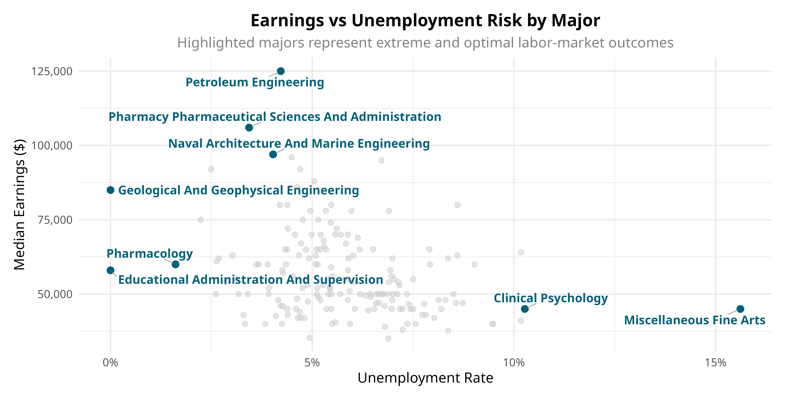
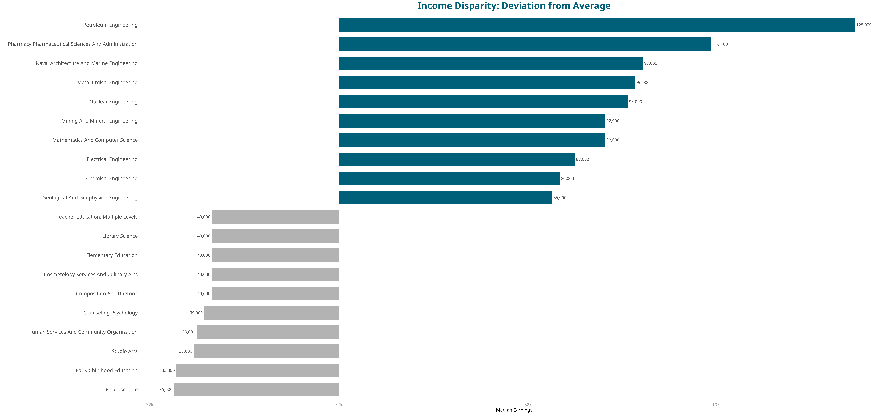
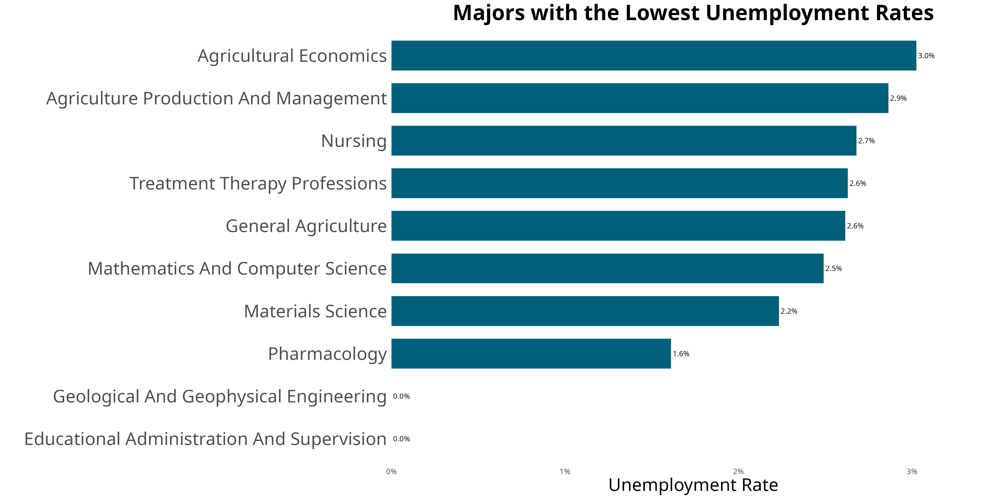
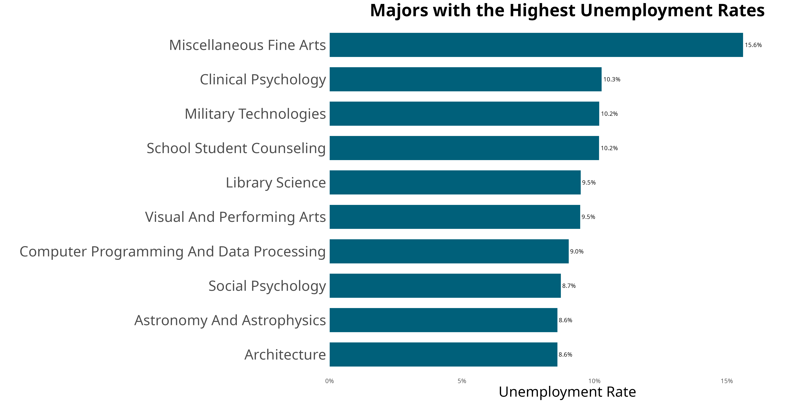

# TheInvisible_Chasm_Analysis
An analysis of earnings and unemployment risks across 173 undergraduate majors using R
# The Invisible Chasm In the Diploma
**Author:** Yağmur Nisan AKTAŞ  
**University:** Eskisehir Technical University - Statistics Department
This repository contains all the R analytics, dataset, and visualizations needed for a project examining economic inequalities between university departments and changing unemployment rates.
## Visual Outputs
Below are the key visualizations generated from the analysis:
# Earnings & Unemployment Analysis

##  Repository Content
- `the invisible chasm.R`: Full R script for data cleaning and visualization.
- `all-ages.csv`: The primary dataset used for analysis.
- `yağmurnisanaktasposter.pdf`: The final project poster.
- ##  Dataset Source Information
The data is sourced from **FiveThirtyEight's "College Majors" dataset**, which is based on the American Community Survey (ACS) 2010-2012. It includes employment and earnings data for 173 undergraduate majors.
